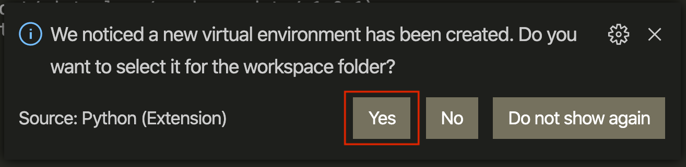

---

- Do not remove this line (it will not be displayed)
{:toc}

---

In the previous module we set up a prototyping environment and we explored the behaviour of a default Python modules (kasa) running on our laptop and our Raspberry Pi. It is time to start coding and define ourself this behaviour.

# Step 1: Github

In this step, we will learn how to use a Version Control System (e.g. Git) to work remotely on your project with other teammates collaboratively. So far, you joined a team on GitHub and wrote documentation in Markdown to report your first lab experiment directly on the GitHub website. You might have encountered some collaboration issues? Indeed, GitHub brings the conversation around the code, but the co-development takes place on each developer's machine.

## Task 1.1: Getting the Shared Repository on your Machine

To get your shared repository on your machine, we use `git clone` followed by the [URL](https://en.wikipedia.org/wiki/URL) to your repository. You can find this URL on the GitHub page of your repository. Click on the green drop-down button 'Code' and copy the URL.


Open VS Code and click on the Source Control button (3rd icon in the left panel), then click on 'clone repository'.


In the text field that opens at the top, paste the URL of your repository and press `ENTER`. A prompt will ask you to choose the location in your machine to save the Repository. For now, choose Desktop.


You now have a copy of your team repository on your machine. In the left panel, you will recognise the tree of files and directories, including the docs directory and the README.md files.


>`git clone [my repository]` Get a copy on the repository on my machine

## Task 1.2 Edit your files

As we were editing the file `README.md` on GitHub in the previous module, we can do the same here on our machine.

Each team member can, on her/his machine, drag and drop a picture of her/himself in the directory `docs/images`. You note that this file is shown in a green font: it is a **new file to track**.

Then, open the README.md and edit the Contributors section to show your profile picture. We use again the Markdown image command, adding a maximum width of 200 pixels (we do not want the pic to appear unreasonably big).

```markdown

```

The README.md file appears now in a yellow font: it has been **modified**.


## Task 1.3 Stage and Commit Changes

We can now prepare our files for a **new version**. We select the changes we want in this new version. This is called 'staging'. Click on the `+` icon next to each file in GitHub source control button on.


After staging the changes, we will add a small description about the changes and create a new version of the git repository by pressing 'right tick mark'. We call this step `Committing`. We are committing our changes in a local repository (on your machine only) and create a snapshot of the entire project directory (locally) with new changes. Later we can move back and revert the changes we want.


>`git add [a file name]` Include a file in the next version of the code
>`git commit -m "Description of my changes"` Create a new version of the code with all staged files

## Task 1.4 Synchronize (Pull/Push)

Till now we have staged all our changes and created a snapshot of the entire directory in our local machine. However, none of our teammates can see these changes yet. We created a new version of the repository on our machine, but we did not share this version on GitHub yet. The remote repository is the one we cloned from the GitHub website (using `git clone`) in the first step.

It also means we do not have the newest versions of the code which were created by our teammates.

At the same time, we also need to pull (download) all the changes that other teammates have pushed into the remote repository.

We can do this both steps together in VSCode by pressing the 'Synchronize' button left corner. (However before pressing this button, make sure you staged and commit all your changes).

[Synchronize remote changes](/assets/img/courses/id5415/module2/assignment/1_4_0.png)

Clicking on this button triggers three actions:

>`git fetch` Get all new versions from GitHub (since the last fetch).
>`git merge` Merge the latest version fetched from GitHub with the latest version on our machine.
>`git push` Upload the new, merged version on GitHub.

You get the newest version existing on GitHub and they are merged with your local version. The resulting version is uploaded to GitHub to be shared with your teammates.

However, there are cases when merging cannot be done automatically. This happens when you modify the same part of the code as your teammate. Git does not know which version to use and rather than deleting one, it asks you what to do. 

Git prompts you to let you choose, for each conflicting block of code, which one to keep. This is called a `conflict`. To resolve the conflict, you can decide what final code you want to keep. Either you can accept all incoming changes (your teammates') or outgoing changes (yours), merge from both sides or compare changes from each side and keep the one you want.

Following this assignment, you and your teammates have edited the README.md file and committed the changes to a new version locally. The first teammates sharing her/his new version on GitHub will have no conflict. The next one will first receive the new version `git fetch` and try to merge `git merge`. At this point, VS Code will prompt you to resolve the conflict.

[Resolve Conflicts](/assets/img/courses/id5415/module2/assignment/1_4_1.png)

After you decide and accept either version, you again have to commit these changes and push to the local repository.

[Commit and Push merged conflicts](/assets/img/courses/id5415/module2/assignment/1_4_2.png)

>Note the fundamental difference between Git and a platform such as Google Docs. 

## Task 1.5 Create a Branch

As every team member start making larger contributions to the repository, we can quickly see how merging can get complicated(as the conflict scenario explained above). To minimize this challenge, we suggest a combination of 2 strategies:

- Commit your code as often as possible. The smaller the versions, the greater chances of a successful automatic merge. (As mentioned in Task 1.4)
- Create separate branches for your different application features.

In Git, a branch is a copy of your another git repository brach with all the commits included(e.g. master). In this copied branch, we can start working without worrying about deleting/editing content from the main branch but commit our changes to the copy of the new branch. Later once the changes are finish we can merge this copied branch back to master.

Let's try to understand this by first creating a branch from the master branch.

By default, you are on the `master` branch. In VS Code you can create a branch by clicking on the bottom left corner on 'master' (the name of your current branch). A menu pops up, click `Create a new branch from`. In the text field, provide the name of your new feature, e.g. 'feature/john-python-exploration'. Then select the branch 'master' (your branch will copied from the current master branch).


Once you have successfully created the new branch, you will see that you are now working from your newly created branch and not master branch.


You can always switch back to another branch (e.g master) to look for reference or edit some code. **NOTE make sure you have commit all the changes from the current branch before switching to the new one.**


A more complete tutorial on branches is available by [Atlassian](https://www.atlassian.com/git/tutorials/using-branches).

# Step 2 Turn on the light!

Now each team member can explore Python in there own branch, committing new versions of their code without conflict.

## Task 2.1 Create a Python Script

We write Python code into files with `.py` extension. Let's create a new file `light.py` in the src directory.To create a new file, right-click on the `src` folder and select the fist option said `New File`. you will see that in file explorer a new text field will ask you to give a name to this new file. Write `light.py` there.


Paste the following lines in the newly created Python script file `light.py`

```python
# This function 'print' the message 'The light is on!' in the Terminal
print("The light is on!")
```

## Task 2.2: Executing a Python script from the Terminal

In the terminal, use the Python command followed by the path to your file to execute your Python script:

```bash
python3 src/light.py
```

The sentence `Turn on the light!` appear in the terminal.

What is happening? The first line (appearing in green) starts with a hash `#`. It is a comment and is ignored by the Python interpreter. Do not hesitate to use comment extensively to remember the purpose of a piece of code.

The second line is a function call. The function `print()` displays a message in the terminal. It takes 1 argument, the message to display).

# Task 2.3 Variables and Types (Data Types)

In programming, a variable is a storage location paired with an associated symbolic name. Each of the variables holds a value that either static or varies over time when the program runs.

The value stored in this variable can have different types. e.g. numerical value (integer / float), a "string" value (word, character), boolean(True-1 / False-0), or a list that holds multiple values in one variable ([0,1,2,three,four]).

Let's look at the two simple example code below for numerical value and string value!

```python
turn_ON = "The light is ON "
turn_OFF = "The light is OFF"

brightness = 60

print(turn_ON + "with brightness: ", brightness)
```

**Do you want to see if it works? Paste each of the above code in VSCode Terminal and press enter until you print the final result**

In the previous(assignment 1) we wrote the minimal code enabling the control of the light bulb from Python in VSCode terminal.

In the next step, you will see the names `bulb` and `result` in one line in python script. These are the names of 2 variables and holds bulb IP Address and result action that coded respectively.

# Step 3 Turn on the light! I mean for real!

Finally some action. Here we will add a structure to our Python script and import the necessary libraries to control the light bulb.

## Task 3.1 Main Function

The main element of a Python program is its `main()` function. As we saw with `print()`, a function takes care of a task, such as showing a message on the Terminal. Let's introduce the `main()` function, which is a function you define as the starting point of you Python program.

In the code below we added `def main():`. This is the syntax to **define** the behaviour of a **function**. Notice that what is 'inside' this function is indented, i.e. moved to the right by one tab. This is how Python recognise that these lines are part of the function.

```python
def main():
    # This function 'print' the message 'The light is on!' in the Terminal
    print("The light is on!")
```

In the terminal, execute your code again (`python src/light.py`)

What happened? Nothing! The text is no longer showing up, what is going on? Well, we defined a function `main()`, but we are not calling it. Like `print()`, to call our function we can write `main()` at the bottom of the file.

```python
def main():
    # This function 'print' the message 'The light is on!' in the Terminal
    print("The light is on!")

main()
```

Execute your code again. We now have our message back. First, we define `def main()`, then we call it at the end by `main()`.

## Task 3.2 Libraries

Our Python code is far from having the ability to talk to the light bulb yet. Fortunately we do not reinvent the wheel for every piece of code. We can reuse code written by others: these are called libraries. Add the following 2 lines at the top of your code.

```python
import asyncio
from kasa import SmartBulb
```

This illustrates two ways of importing libraries into your program. The first statement `import ...` import **the entire** asyncio library. The second statement `from ... import ...` is **specifically selecting** the definition `SmartBulb` from the library called `kasa`.

- 'asyncio' is part of Python (no need to install it). By default, statements of our Python scripts are interpreted one after the other, waiting the previous one to be completed. This is a **synchronous** sequence of statements. However, to control the light bulb we need to send a message over the network, and wait for it to answer back. With synchronous statements, you would block the Python program till you receive this response. Asyncio gives us the ability to execute statements in an **asynchronous** way, meaning that we can send our message to the light bulb, do something else, then come back where we left when we receive a response from the light bulb.

- 'kasa' is the library that we used in the previous module to control the light bulb.

To ensure that we install this library for our project without disturbing any other Python settings, we setup a virtual environment that we call 'venv'. To do so, enter the following command in the terminal.

```bash
python3 -m virtualenv venv
```

VS Code recognise the creation of this new environment and ask you if you want to switch, click 'Yes'.



Kill the Terminal (little trashcan icon on right) and open a new Terminal to load this new environment. Notice the difference, the Terminal statement start with `(venv)` and the Python environment is selected in the bottom panel.


We can now install the kasa library

```bash
pip install python-kasa --pre
```

Like we did in the previous assignment, we can use `kasa discover` to find the IP address of our light bulb on the network.


Look up the `host` line of the result for the IP address.

Let's transform our `main()` to be asynchronous.

```python
# Import libraries
import asyncio
from kasa import SmartBulb
# 'async' transform our main() into an asynchronous function
async def main():
    # Call the definition of a light bulb, Note: replace the IP address with the one you found using kasa discover command in terminal
    bulb = SmartBulb("192.168.1.110")
    # 'await' tells the program to wait till getting a result from the light bulb
    result = await bulb.turn_on()
    # Once we receive it, we call print() to show the result in the Terminal
    print(result)

# We call main() in the asynchronous environment
asyncio.run(main())
```

The transformation of your code looks like this:


Let's run this code! The light should turn on and the Terminal should look like that:


## Task 3.3 Analysing the Result

What do we see in the Terminal? A `JSON` structure which is a typical way to exchange data on the Internet of Things. It starts and ends with curly brackets `{}`. It is composed of `"key": "value"` sets separated by a comma `,`. A value can be any of the primitive types `string`, `float`, `integer` or `boolean` covered in the previous [Step](#task-23-variables-and-Types). It can also be a JSON structure itself with curly brackets `{}` or an array of any of those types, delimited with square brackets `[]`.

```json
{
  "key": "value",
  "key2": ["array", "of", "values"],
  "key3": {
    "subkey": "value"
  }
}
```

In our example, you can recognise the key 'on_off', an `integer` with value `1`: The light is on.

**Commit and Push!** You've written a new piece of code, let's make sure that Git keeps a version of it. To do so, repeat [Task 1.3](#task-13-stage-and-commit-changes) and [Task 1.4](#task-14-stage-and-commit-changes). Your commit message could be 'controlling the light bulb'

# Step 4  Shaping the Lamp's Behaviour

So far we explored variables and states to store information throughout our code, and we can use use the `kasa` library to control a connected light bulb. In this step, we want to shape the behaviour of the light to make it blinks for 5 seconds. We achieve this with conditions and repetitions: we call these elements `control flow statements`.

# Step 4.1 Toggle switch

As the name suggests, conditions are checkpoints in your code to make sure it won't execute the particular block of code until the condition is fulfilled.

Let's explore the `if/else` statement with our light example:

Here we will first extract the current state of the light. Then, using the `if` statement we will check the state of the light. If it is `ON`, then we will turn it `OFF`. Otherwise, using the `else` statement we will turn the light `ON`. After updating the light states, we will print its current status as well.

Copy & Paste the below code in your `light.py` file (erase the code we typed before) and run the script from Terminal (you know how to run the script from the Terminal, we did it in the previous step):

```python
import asyncio
from kasa import SmartBulb

# 'async' transform our main() into an asynchronous function
async def main():
    # Call the definition of a light bulb, replace the IP address with the one found with kasa discover
    bulb = SmartBulb("192.168.1.110") # Make sure to replace your smart-bulb IP Address here

    # 'await' tells the program to wait till getting a result from the light bulb
    result = await bulb.get_light_state()
    print (result)

    #Example if condition
    if result['on_off'] == 1: #If the light bulb is ON
        print("Light was ON, I turned it OFF")
        await bulb.turn_off() #Turn_Off the bulb
    else:
        print("Light was OFF, I turned it ON")
        await bulb.turn_on() #Turn_On the bulb if it is OFF

    #Getting the current stat of light bulb after updating it previous stat above.
    result = await bulb.get_light_state()
    print (result)

# We call main() in the asynchronous environment
asyncio.run(main())
```

After running the scripts, you will see that your light bulb will either turn `ON` or turn `OFF` according to its current state. You will also see its current status in the Terminal window.


To learn more about python condition, have a look at the [Python guide on Conditions] (https://www.learnpython.org/en/Conditions)

## Task 4.2 Loops

In contrast, if you want to run a piece of code in a continuous manner over time (e.g keep blinking the light bulb for every 10 seconds), you can use certain control flow which is called `Loops`.

There are two common loop statement in python: `for` and `while`.

Let's update our `light.py` file. You don't need to delete anything, just add the below line of code.

First import the time library in top of the file before `async def main():`:

```python
from time import sleep
```

Then, insert the following code after the last `print(result)`.

```python
 for x in range(10):        # Here we are asking to loop the indented code for 10 times
    await bulb.turn_on()    # Turn on the light
    print("Loop: ", x)      # Print current loop number
    sleep(1)                # Sleep for 1 seconds
    await bulb.turn_off()   # Turn off the light
    print("Loop: ", x)      # Print current loop number
    sleep(1)                # Sleep for 1 seconds
```


What happened here? We have created a `for` loop which will keep executing the code inside its block for 10 times and then terminates. Inside this loop, we wrote a code that turns the light bulb `ON` and `OFF`. We are also using `time` library in this example to hold the execution of code for a second, in between turning ON/OFF the bulb.

To learn more about Python `for` statements, have a look at the [Python Guide on For Loops](https://www.learnpython.org/en/Loops)

**Commit and Push!** You've wrote a new piece of code, let's make sure that Git keeps a version of it. To do so, repeat [Task 1.3](#task-13-stage-and-commit-changes) and [Task 1.4](#task-14-stage-and-commit-changes). Your commit message could be 'shaping the light bulb behaviour'

**Updating the CHANGELOG file** In this assignment you have made significant additions to your prototype. Edit the file `CHANGELOG.md` and what you have learnt in this assignment today.
