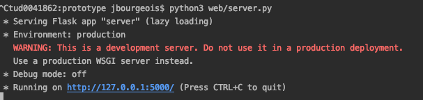

## Assignment 5 focuses on implementing a functionlity to interact with the lightbulb from a webpage using a local server. We will first create a a local web-server in our machine. Through this web-server we will create a simple web page with button that interact with the bulb.

- Do not remove this line (it will not be displayed)
  {:toc}

---

TODO full assignment

# Step 1: Configuring Webserver

## Task 1.1 Installing Flask Web-server

To create the web-server, we will use a python web-server moudel callled [Flask](https://palletsprojects.com/p/flask/).

Like other Python library, you can install this web-server modle using pip. In your VS Code terminal activate the virtual environment and type in:

```bash
python -m pip install Flask
```

## Task 1.2 Configuring the Rest API

TODO A little bit information about what is REST API

Now that we have webserver moudule installed, let's implement a simple REST API.

First create a new folder `web` inside `src` folder of your project. Then, create a file `server.py` and insert the following line of python code:

```python
from flask import Flask
app = Flask(__name__)

@app.route('/')
def hello_world():
    return 'Hello, World!'

if __name__ == '__main__':
    app.run()
```

This code import the flask library and create an `app`, a typical name to refer to the web application you start building.

The line starting with `@` is an annotation, used to complement the code. In this context, we specify a web path, the root '/', to trigger the function `hello_world()` right bellow.

Finally, the script define the `main`, where the programme start. In this case `run` our `app`, meaning we start the web server.

In the terminal, execute the Python file to start the web server:

```bash
python3 web/server.py
```

You will see that server has been started.



Open a web browser and type in: http://localhost:5000/

You should see appear a 'Hello world' on the web page. This is the result of the hello_world function. In VS Code, in the `hello_world` function, you can change the message. Then, in the terminal, stop the server (Ctrl+C) and execute your script again (Arrow up + Enter). Back in the web browser, refreshing the page should display your new message.

## Task 1.3 Create Simple webpage

So far we have written a piec of code that is running on the server side and directly printing a `Hello World` message. NowLet's try to create a simple webpage with button that print the `hello world` message

first inside the `web` folder, create another two folders called `static` and `templates`. Inside templates, create an html file called `index.html`.

Copy the following line of HTML code inside the file:

TODO clicking button should print light bulb details

```html
<html>
  <head>
    <title>My lightbulb app</title>

    <script
      src="//cdnjs.cloudflare.com/ajax/libs/socket.io/2.2.0/socket.io.js"
      integrity="sha256-yr4fRk/GU1ehYJPAs8P4JlTgu0Hdsp4ZKrx8bDEDC3I="
      crossorigin="anonymous"
    ></script>
    <script type="text/javascript" charset="utf-8">
      var socket = io();
      socket.on('connect', function () {
        // socket.emit('json', {data: 'I\'m connected!'});
      });

      socket.on('json', function (msg, cb) {
        if (msg.data !== undefined) {
          gauge1.update(msg.data);
        }
      });

      function sendMessage(message) {
        socket.emit('json', { data: NewValue() });
      }
    </script>
  </head>
  <body>
    <h1>My lighbulb App</h1>
    <button onclick="sendMessage('Hello World!')">Click!</button>
  </body>
</html>
```

Now go to `server.py` and add replace:

```python
@app.route('/')
def hello_world():
    return 'Hello, World!'
```

with the following function:

```python
@app.route('/')
def home():
    return render_template('index.html')
```

Restart the server by running `server.py` again and refresh the page on your browser. You will see a that the webpage we have created with title and button has been rendered in our brwoser.

## Task 1.4 External Access of the server

For now, this web page is only accessible from your computer. In your `server.py`, at the bottom, you can provide a parameter `host='0.0.0.0` to the run function to remove this constraint:

```python
if __name__ == '__main__':
    app.run(host='0.0.0.0')
```

This means that your server will accept incoming request from any source e.g mobile, tablet connected to the same network. However you need to know the ip address of your current machine that is hosting this server.

You can look up your ip address with the command

**Mac/Linux**

```bash
ipconfig getifaddr en0`
```

**Windows**

Type below command in command prompt and look for `IPv4 Address. . . . . . . . . . . : 192.*.*.*`

```bash
ipconfig
```

Once you have the local ip address of your machine, use a phone or other computer connected and type this local ip address of your machine. You will see a webpage with title and button has been rendered.

**Note:** On some platform you might also need to disable/create a rule for your Firewall.

For information, [Fullstack](https://www.fullstackpython.com/flask.html) provides some useful information to go further.

# Step 2: Code a REST API

TODO Share sensor data, control light bulb

So far we have created REST Api as the default action that will print the hello world message. However, a RESTFul API can include more than that. Here is an informative link: [REST API](https://www.restapitutorial.com).

TODO Code for therest api in our light-bulb context

TODO function to retrieve the lightbulb details when click on html button
