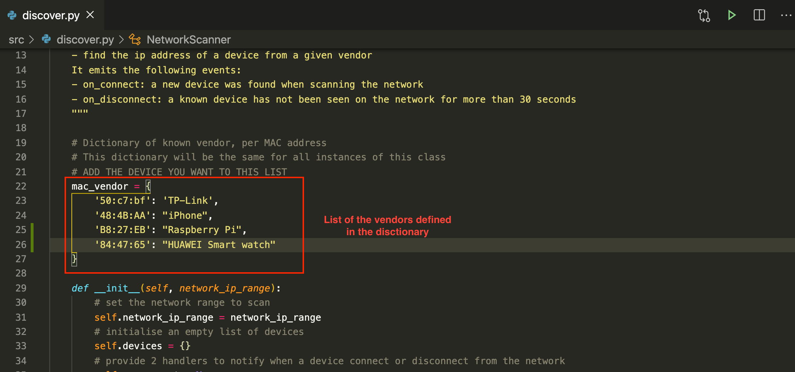
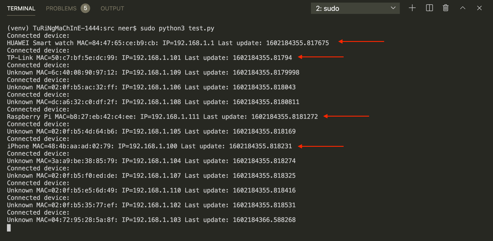

---

- Do not remove this line (it will not be displayed)
  {:toc}

---

In our last assignment, we have implemented the script `discover.py` to scan the network and find the IP Address of our lightbulb. This enables us to automatically create a Lightbulb object and control the lightbulb without specifying a fix IP address.

During the live session, we explored how to refactor this initial code into a `NetworkScanner` class which keep scanning the network for devices. You can copy and paste the snippet available [here](https://gist.github.com/jackybourgeois/73766b1d3a5847ce03d135447ba77ba8) in a file `discover.py`.

This `NetworkScanner` can send us events when new devices are found on the network and when devices are no longer connected.

# Step 1 Retrieve your phone MAC address

## Task 1.1 Create a NetworkScanner

In `main.py`, locate the following lines:

```python
lightbulb_ip_address = find_lightbulb("192.168.1.1/24")
lightbulb = Lightbulb(lightbulb_ip_address, LIGHTBULB_THING_IP, LIGHTBULB_PRIVATE_KEY_PATH)
```

Replace then with:

```python
# create an object NetworkScanner
scanner = NetworkScanner("192.168.1.1/24")
# set the handler function for the events on_connect and on_disconnect
scanner.on_connect = on_device_connect_to_network
scanner.on_disconnect = on_device_disconnect_from_network
# start scanning
scanner.start_scanning()
```

What is `192.168.1.1/24`? This is the range of IP addresses we want to scan. If the IP address of your lightbulb was different from 192.168.1, then replace the three first digits by the one from your lightbulb. `/24` is called 'Net Mask' in the network jargon. It means that we will look for IP addresses that have the same three first digits, and any value as fourth digit (from 1 to 255).

For instance, our scanner will be able to find a device `192.168.1.5` or `192.168.1.134` or `192.168.1.231`. However, it will not look for `192.168.200.5` because 200 does not match the third digit.

## Task 1.2 Define handlers

In this new code, we note that we set two handler functions: one for the `on_connect` events and one for `on_disconnect` events. We need to define these two functions. Let's do this in `main.py` as follows:

```python
def on_device_connect_to_network(device):
 print("Connected device:")
 # print device information
 device.show()

def on_device_disconnect_from_network(device):
 print("Disconnected device:")
 # print device information
 device.show()
```

We can now execute `main.py`.

However, on Mac and Raspberry Pi, you need to execute your code with as administrator for Scapy to work properly.

For this, add `sudo` in front of your command:

```bash
sudo python scr/main.py
```

**Note:** Make sure that your phone is connected to the same network as your lightbulb and current machine.

It will print the MAC address of all the connected device to your connected network, including your lightbulb as TP-Link.


## Task 1.2 Identifying devices per vendor

Our code shows the IP and MAC addresses of the devices as they connect on the network. However, most addresses should appear with the name 'Unknown': nothing tells our code what is the relationship between MAC address and vendor.

Follow [Step 3](https://id5415.datacentricdesign.org/module4/assignment#step-3-associate-mac-addresses-to-vendors) from Assignment 4 to obtain the vendor's name, and then add it in `mac_vendor` dictionary defined in `discover.py` script. Each team member can add the vendor of the devices they want to recognise.

Here is an example of an updated list:



Executing your code again, it should show the name of your devices. For example:



# Step 2 Implement the contextual behaviour

Our code is now retrieving the details of the devices connected on the network, including the lightbulb, Pi and your phone. It is also associating MAC addresses to vendors for the one we specified in the `mac_vendor` dictionary. Now we can use the `on_connect` and `on_disconnect` events in two ways:

- to connect to the lightbulb when it is found
- to control the lightbulb when our phone connects to or disconnects from the network. This could represent an event 'At Home' and 'Away from home'.

To do that, you can improve the two handlers in `main.py`. In the `on_connect()` you need to create a lightbulb. You can use the code of the [Lightbulb class](https://id5415.datacentricdesign.org/module2/) we provide in Module 2. Then, add the condition and the call of `turn_on()` call to control the light. In the `on_disconnect()`, add the condition and the call of `turn_off()`.

```python
def on_device_connect_to_network(device):
    device.show()

    # condition to check the device name,
    if device.name == 'TP-Link':
        print('lightbulb back on the network')
        # create a lightbulb object and print bulb status

    # condition to check the device name
    if device.name == 'Phone':
        print('At home')
  # If a lightbulb is connected
         # turn ON the lightbulb

def on_device_disconnect_from_network(device):
    if device.name == 'TP-Link':
        print('Connection lost with the lightbulb')

    if device.name == 'Phone':
        print('Away from home')
  # If a lightbulb is connected
         # turn OFF the lightbulb
```

This is an example of control based on the network event. You can now involve the sensor events and your lightbulb `pulse()` or `morse()` as part of the flow.

# Step 3 Map the flow of your code

While the code of `main.py` is not too long, the flow is complicated. Let's visualise the code.

Have a look at the NetworkScanner class, the LightBulb class and your `main.py`. Create a flow chart of your code to map the process. For instance:

- what are the steps?
- are there elements executed in parallel?
- are there conditions?

> **Report** On GitHub, in your lab experiment report, report your process of integrating the NetworkScanner in your code. Explain with your own word how the NetworkScanner works. Describe the flow from detection to action on the lightbulb. Add your flow chart.

Upload this flow chart in your repository.

> **Merge and Push** Once you are done with your development and test cycle, do not forget to merge your branch into your master branch.

You can now try your code on the Raspberry Pi.

> **Updating the CHANGELOG file** In this lab experiment you have made significant additions to your prototype. Edit the file `CHANGELOG.md` and add what you have achieved in this assignment.
